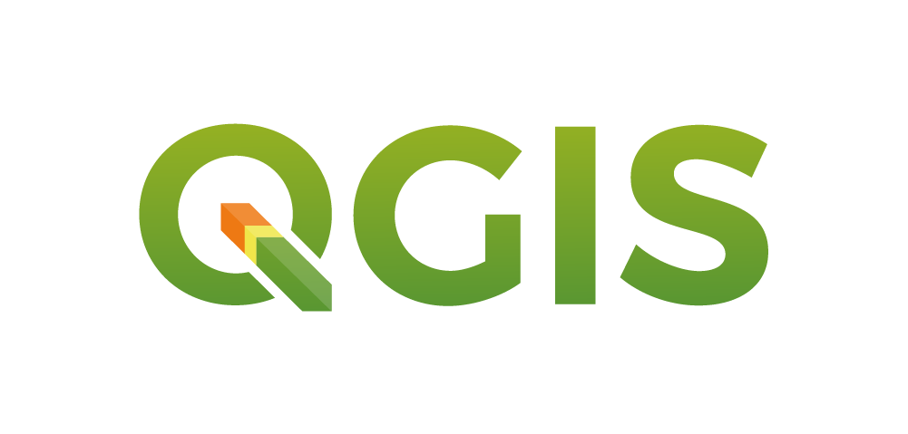

# Introducing GIS with the opensource software QGIS

QGIS is an opensource GIS desktop software compatible with mac, PC and Linux systems.

You can be part of the community at [qgis.org](https://qgis.org/en/site/)!

## Workshop Resources
 - Software - access via the [QGIS download page](https://qgis.org/en/site/forusers/download.html)
 - Data - download from this dropbox [QGIS workshop data folder](https://www.dropbox.com/sh/3hxsx7vkv5mwy5e/AAAZWoctDaXnHgpebMdlBO62a?dl=0)

## Workshop Goals
By the end of this workshop, you will be able to:
- Explain why spatial information can be important
- Describe vector and raster geospatial data
- Load data into QGIS
- Symbolize ...
- Create a basic map!

## Outline
- [What is GIS?](#what-is-gis)
- Why QGIS?
- Data types
- The QGIS Interface
- Loading Data
- Symbolizing Data
- Exploring Spatial Relationships
- Adding a Basemap Plugin
- Making a Print Layout

## What is GIS?
And more importantly, why might we want to use it?

GIS stands for either Geographic Information System or Geographic Information Science.

"Geographic Information System" typically refers to the software, like QGIS, we use to create spatial data and to investigate spatial relationships between that data.

"Geographic Information Science" is the framework we use to ask questions about the spatial relationship between data. This framework is broader than working within certain GIS-specific softwares like QGIS. You will also hear people use the phrase "Geospatial Science."

Why is location information important? The knowlege gained by spatial data enhances our understanding.

For example, we may assume that our friend who lives in the city/county of Denver has easy access to a LOT of good restaurants because we know the county has many. But when we map out that most restaurants are downtown and realize our friend lives way out by Denver International Airport, we have a different perspective:

In addition, humans are largely visual. We respond well to seeing information presented in graphs and maps. By using GIS software, we can share our message quickly by *carefully* presenting it in the form of a map. In the above example, we could spend some time explaining that Denver has an odd stretched out boundary to accommodate placing the airport out east. Or we can just **show** it to get the idea across. (*How* we show our data on a map will change our message, but that's for a different workshop.)

Take a moment and think about a particular instance in your life or work where spatial information changes how you think about the situation.

## Why QGIS?

QGIS is an open source, community-driven desktop GIS software that allows users to visualize and analyze spatial data in a variety of ways. There are many reasons to use QGIS, but here are a few:

- It's a robust, powerful desktop GIS
- Runs on all major platorms: Mac, Linux, & Windows
- Free of charge, all access (no paid add-ons or extensions)
- Frequent updates & bug fixes
- Responsive, enthusiastic community
- Integration with other geospatial tools & programming languages like R, Python, & PostGIS
- Access to analysis tools from other established software like GRASS and SAGA
- Native access to open data formats like geoJSON & GeoPackage
- Comes in more than 40 languages, making it easier to work with a larger variety of colaborators
- Growing use by local, state, federal, and international governments

## Data Types

Geospatial data can come in many file types and forms. The two main styles of data you'll encounter are vector and raster data.

### Vector Data
Vector data most commonly represents discrete objects in the real world with points, lines, and polygons.

If you've ever been without your smartphone and needed to sketch out a map to direct a friend to your house, you were drawing "vector" data. You drew lines for the streets, perhaps you added a rectangle to show a field your friend had to pass, and maybe you made a star to represent your home.

Depending on the scale of your map - that is, how much you're zoomed in - one object could have different representations. For example, if a map is of just one farm, the barn might be a rectangule, but if the map is of an entire agricultural valley, the barn might be shown as a single point.

Lines representing a single value (isolines) can also be used to represent continuous data like the elevation contours in the next figure below.

### Raster Data
Raster data stores information in a grid. It is ideal for continuous data like elevation (see the digital elevation model or "DEM" below), but can also show discrete objects by using repesentative number codes. For example, 1 could represent land and 0 could represent water.

Digital photos are raster data you are already familiar with. If you zoom in far enough on a digital photo, you'll see that photo is made up of pixels, which appear as colored squares. Pixels are cells in a regular grid and each contains the digital code that corresponds to the color that should be displayed there. Satellite images are similar. The information that is stored in each grid cell depends on the types of sensors each satellite carries.

## Download data
Here is a list of data that are used in this workshop:

Vector Shapefiles:

| Layer | Filename |
| ----- | -------- |
| Area of Interest Boundary | DenverAOI.zip|
| Denver Tree Inventory | selecttrees_DenverAOI.zip |
| Water courses | waterlines_DenverAOI.zip |
| Water bodies | waterbodies_DenverAOI.zip |
| Streets | streets_DenverAOI.zip |
| Parks | parks_DenverAOI.zip |

Raster GeoTIFF:

| Layer | Filename |
| ----- | -------- |
| Digital Elevation Model (DEM) of Denver | USGS1mDEM_2013_DenverAOI_EPSG4326.tif |

You can access all of these data files from this [data folder](https://www.dropbox.com/sh/3hxsx7vkv5mwy5e/AAAZWoctDaXnHgpebMdlBO62a?dl=0) (Same as the top of this workshop)

## Start QGIS & Open a New Project

Start QGIS in the way you typically open any program on your particular computer's operating system. It will take a little bit to start.

When QGIS opens, you may see a list of recent projects, or if this is a new installation, there may not be any listed. It doesn't matter which you see, because we want to start a new project. To do this, click on the Project menu in the upper left of the window and select New - or you can click the white page icon that is usually near the Project menu on the tool bar.

## QGIS Interface
Although this software is capable of integrating with code, we'll use the Graphic User Interface or GUI ("gooey").

Here's what the QGIS GUI looks like with some important areas highlighted (NOTE, yours may look a little different because you can move toolbars and windows around to your liking, including toggling them on/off.):

[image]

1. Layers List / Browser Panel
2. Map Canvas
3. Navigation toolbar - use these for moving around the map canvas
4. SAVE project (it's always good to save your work as you go!)
5. Identify Features (useful for quickly investigating an object)
6. Open Attribute Table
7. Open Data Source Manager (AKA adding data)

Hover over the buttons for tooltips that will help you explore and remember what each tool is.

For a more in-depth exploration of all of these controls (and for other in-depth lessons!) see the [QGIS training manual](https://docs.qgis.org/3.16/en/docs/training_manual/)

## Import data into QGIS
Let's load some data.

### Raster Data
Let's start by loading the raster data:

- Click on the Open Data Source Manager button on your toolbar. It looks like three cards (one red, one yellow, and one blue) fanned out. Or, find it on the Layer menu.
- Click the Raster button (it looks like a checker board) on the left side of the Data Source Manager window.
- Click on the "..." button in the Source section in the middle of the window. Navigate to where you saved your workshop data and select the DEM_SF.tif file.
- Click Open.
- Some options will appear on the page. We can leave the defaults for this dataset.
- Finally, click "Add" and you should see a black and white raster image appear in the map canvas below the dialog you're working in. (At this point, if we didn't have our data in the same projection, you might see a Select Transformation dialog pop up.)

You can leave the Data Source Manager window open so we can add some more data.

### Vector Data

Shapefiles are a very popular vector data format, so that's what we'll work with today, but geopackage is a good open format alternative (and has the advantage of being just one file).

Let's load our shapefile data:

- In the Data Source Manager, click on the Vector tab on the left.
- In the Source section, click on the "..." and navigate to the folder containing your vector data.
- Holding down the Ctrl button on your keyboard while you click, select the StreetCenterlines.shp, SeismicHazardZones.shp, and Shoreline.shp (don't worry about the other files that make up a shapefile - QGIS will know to look for these when you specify the .shp file). Then click Open. If the Select Transformation dialog appears, pick a transformation that fits the data, such as NAD83 to WGS 84 (43).
- In the Options section, you can leave the default values as they are for this data. Make note of what options are there - the ENCODING section is particularly helpful if your attributes are written in a different character set than the default, UTF-8.
- In the Data Source Manager click Add.

DenverAOI - *A boundary defining our "area of interest." This is a reference file only that was used for "clipping" the other data to our area.*

## Saving Project Files
Now that we've added data to our project, let's save it so we can come back to it later.

- Click on the blue floppy disk icon (or from the File menu, select Save).
- Navigate to where you want to save your project file.
- In the File Name box, type the name you would like your file to have (this will end in .qgs or qgz). Give it a descriptive name so you'll remember what the file was for.
- Click Save.

## Exploring Data
Always the first thing to do when working with data is to see what it actually IS! With geopspatial data, there are a few ways to look deeper into the information in a data layer.

### Visual Check
The first thing we'll do is visually inspect the map area to see what our layers look like.

Layer visiblity

click them on and off
drag them up and down in the layers list to change the drawing order
see max and min of raster layer

Navigating around

Use the mouse to zoom in and out. Go to the Navigation toolbar and click the white hand and use it to pan around. The tool with the magnifying glass and back arrow will take you back to the last view you had. Play around and get comfortable moving around in the map canvas.

*HINT*: If you right click on a layer in the layers list, you'll see a menu that says, "Zoom to Layer" at the top. This is a great way to find your way back to a view on the map canvas if you happen to get lost. Also, this right-click menu is an alternative way to access tools!

### Examine the Attributes

Whereas raster data has certain values tied to each grid cell of the raster, vector data has the ability to tie a lot of information to features via an attribute table. Think of this as a spread sheet where each row of the spreadsheet represents one feature in a layer, with each column in that spreadsheet telling us something about that feature or object.

Let's open the attribute table for our trees layer and see what information we can find there!

- Click on the selecttrees_DenverAOI layer in the layer list to make sure it's highlighted
- Open the attribute table by clicking the table-looking button in the Attributes Toolbar OR right click on the layer and select Open attribute table
- A new window will pop up with columns describing characterics of the trees
- Notice the Column headers or Field names - all this information gives us power to do more with the data
- The field SPECIES_CO stands for species common name. We'll use this in the next section!

## Symbolizing Data

When we pull our data in, QGIS will give our vector data random single colors and our raster data a default black and white "stretched band." We have the ability to change these colors as we'd like and change the symbolization of our data in other ways.

Let's start by by making sure our rivers, streams, etc. are blue:

## Investigating Relationships

Ponderosas within a distance of water
blue spruce intesecting with parks
weird stream line going along high elevation

## 

## Making a map
