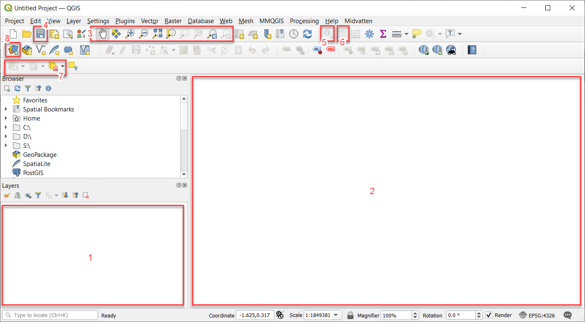
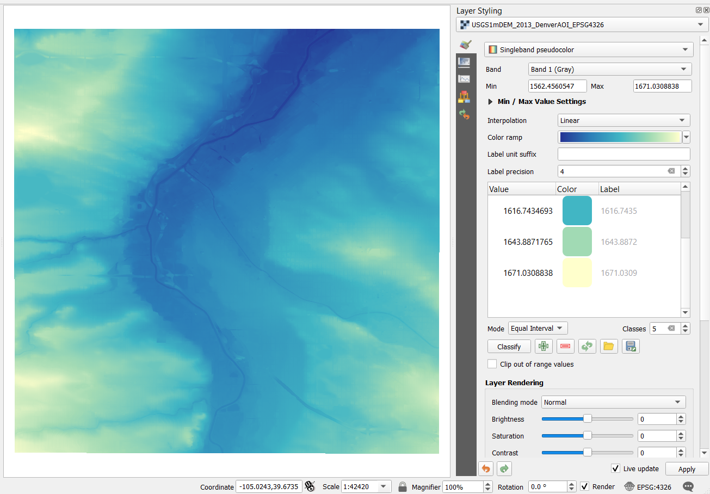
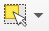

# Introducing GIS with the opensource software QGIS

QGIS is an opensource GIS desktop software compatible with mac, PC and Linux systems.

You can be part of the community at [qgis.org](https://qgis.org/en/site/)!

## Workshop Resources
 - Software - access via the [QGIS download page](https://qgis.org/en/site/forusers/download.html)
 - Data - download from this dropbox [QGIS workshop data folder](https://www.dropbox.com/sh/3hxsx7vkv5mwy5e/AAAZWoctDaXnHgpebMdlBO62a?dl=0)

## Workshop Goals
By the end of this workshop, you will be able to:
- Explain why spatial information can be important
- Describe vector and raster geospatial data
- Load data into QGIS
- Style data layers
- Create a basic map!

## Outline
- [What is GIS?](#what-is-gis)
- [Why QGIS?](#why-qgis)
- [Data types](#data-types)
- [The QGIS Interface](#qgis-interface)
- [Loading Data](#loading-data)
- [Styling Data](#styling-data)
- [Exploring Spatial Relationships](#investigating-spatial-relationships)
- [Making a Print Layout](#making-a-map)

## What is GIS?
And more importantly, why might we want to use it?

GIS stands for either Geographic Information System or Geographic Information Science.

"Geographic Information System" typically refers to the software, like QGIS, we use to create spatial data and to investigate spatial relationships between that data.

"Geographic Information Science" is the framework we use to ask questions about the spatial relationship between data. This framework is broader than working within certain GIS-specific softwares like QGIS. You will also hear people use the phrase "Geospatial Science."

Why is location information important? The knowlege gained by spatial data enhances our understanding.

For example, we may assume that our friend who lives in the city/county of Denver has easy access to a LOT of good restaurants because we know the county has many. But when we map out that most restaurants are downtown and realize our friend lives way out by Denver International Airport, we have a different perspective:

In addition, humans are largely visual. We respond well to seeing information presented in graphs and maps. By using GIS software, we can share our message quickly by *carefully* presenting it in the form of a map. In the above example, we could spend some time explaining that Denver has an odd stretched out boundary to accommodate placing the airport out east. Or we can just **show** it to get the idea across. (*How* we show our data on a map will change our message, but that's for a different workshop.)

Take a moment and think about a particular instance in your life or work where spatial information changes how you think about the situation.

## Why QGIS?

QGIS is an open source, community-driven desktop GIS software that allows users to visualize and analyze spatial data in a variety of ways. There are many reasons to use QGIS, but here are a few:

- It's a robust, powerful desktop GIS
- Runs on all major platorms: Mac, Linux, & Windows
- Free of charge, all access (no paid add-ons or extensions)
- Frequent updates & bug fixes
- Responsive, enthusiastic community
- Integration with other geospatial tools & programming languages like R, Python, & PostGIS
- Access to analysis tools from other established software like GRASS and SAGA
- Native access to open data formats like geoJSON & GeoPackage
- Comes in more than 40 languages, making it easier to work with a larger variety of colaborators
- Growing use by local, state, federal, and international governments

## Data Types

Geospatial data can come in many file types and forms. The two main styles of data you'll encounter are vector and raster data.

### Vector Data
Vector data most commonly represents discrete objects in the real world with points, lines, and polygons.

If you've ever been without your smartphone and needed to sketch out a map to direct a friend to your house, you were drawing "vector" data. You drew lines for the streets, perhaps you added a rectangle to show a field your friend had to pass, and maybe you made a star to represent your home.

Depending on the scale of your map - that is, how much you're zoomed in - one object could have different representations. For example, if a map is of just one farm, the barn might be a rectangule, but if the map is of an entire agricultural valley, the barn might be shown as a single point.

Lines representing a single value (isolines) can also be used to represent continuous data like the elevation contours in the next figure below.

### Raster Data
Raster data stores information in a grid. It is ideal for continuous data like elevation (see the digital elevation model or "DEM" below), but can also show discrete objects by using repesentative number codes. For example, 1 could represent land and 0 could represent water.

Digital photos are raster data you are already familiar with. If you zoom in far enough on a digital photo, you'll see that photo is made up of pixels, which appear as colored squares. Pixels are cells in a regular grid and each contains the digital code that corresponds to the color that should be displayed there. Satellite images are similar. The information that is stored in each grid cell depends on the types of sensors each satellite carries.

## Download data
Here is a list of data that are used in this workshop:

Vector Shapefiles:

| Layer | Filename |
| ----- | -------- |
| Area of Interest Boundary | DenverAOI.zip|
| Denver Tree Inventory | selecttrees_DenverAOI.zip |
| Water courses | waterlines_DenverAOI.zip |
| Water bodies | waterbodies_DenverAOI.zip |
| Streets | streets_DenverAOI.zip |
| Parks | parks_DenverAOI.zip |

Raster GeoTIFF:

| Layer | Filename |
| ----- | -------- |
| Digital Elevation Model (DEM) of Denver | USGS1mDEM_2013_DenverAOI_EPSG4326.tif |

You can access all of these data files from this [data folder](https://www.dropbox.com/sh/3hxsx7vkv5mwy5e/AAAZWoctDaXnHgpebMdlBO62a?dl=0) (Same as the top of this workshop)

## Start QGIS & Open a New Project

Start QGIS in the way you typically open any program on your particular computer's operating system. It will take a little bit to start.

When QGIS opens, you may see a list of recent projects, or if this is a new installation, there may not be any listed. It doesn't matter which you see, because we want to start a new project. To do this, click on the Project menu in the upper left of the window and select New - or you can click the white page icon that is usually near the Project menu on the tool bar - or you can double click on the "New Project" EPSG:4326 template (we will be using EPSG:4326, but don't worry about what that means for today).

## QGIS Interface
Although this software is capable of integrating with code, we'll only use the Graphic User Interface or GUI ("gooey") in this workshop.

Here's what the QGIS GUI looks like with some important areas highlighted: 

(NOTE, yours may look a little different because you can customize this GUI. You can move toolbars and windows around to your liking, toggling them on/off, and add different capabilities to your version of the software.)

1. Layers List / Browser Panel
2. Map Canvas
3. Navigation Toolbar - use these for moving around the map canvas
4. SAVE project (it's always good to save your work as you go!)
5. Identify Features (useful for quickly investigating an object)
6. Open Attribute Table
7. Selection Toolbar
8. Open Data Source Manager (AKA adding data)

Hover over the buttons for tooltips that will help you explore and remember what each tool is. Some will be greyed out because they can't work without data present in the project.

For a more in-depth exploration of all of these controls (and for other in-depth lessons!) see the [QGIS training manual](https://docs.qgis.org/3.16/en/docs/training_manual/)

## Loading Data
Let's import some data into QGIS!

### Raster Data
Let's start by loading the raster data:

- Click on the Open Data Source Manager button on your toolbar. It looks like three cards (one red, one yellow, and one blue) fanned out. Or, find it on the Layer menu.
- Click the Raster button (it looks like a checker board) on the left side of the Data Source Manager window.
- Click on the "..." button in the Source section in the middle of the window. Navigate to where you saved your workshop data and select the .tif file.
- Click Open.
- Finally, click "Add" and you should see a black and white raster image appear in the map canvas below the dialog you're working in as well as see the file appear in the layers list box. (At this point, if we didn't have our data in the same projection as the project (the EPSG thing), you might see a Select Transformation dialog pop up.)

You can leave the Data Source Manager window open so we can add some more data.

### Vector Data

Shapefiles are a very popular vector data format, so that's what we'll work with today, but geopackage is a good open format alternative (and has the advantage of being just one file, so it can be easier for file management).

Let's load our shapefile data:

- In the Data Source Manager, click on the Vector tab on the left.
- In the Source section, click on the "..." and navigate to the folder containing your vector data.
- Holding down the Ctrl button on your keyboard while you click, select the parks_DenverAOI.zip, selecttrees_DenverAOI.zip, streets_DenverAOI.zip, waterbodies_DenverAOI.zip, & waterlines_DenverAOI  (If you have unzipped the vector files, just click on the .shp files with the same name. Don't worry about the other files that make up a shapefile - QGIS will know to look for these when you specify the .shp file!) Then click Open. Again, this is a time when the Select Transformation dialog would appear if you try adding data with a different projection. If you do add other data that isn't EPSG:4326, select an appropriate transformation that converts your layer to that projection.
- In the Data Source Manager click Add.
- Click Close in the dialog box

You don't need the DenverAOI file, but you can add it to your project if you'd like. It is merely a boundary defining our "area of interest" I used for "clipping" the other data to our area.

## Saving Project Files
Now that we've added data to our project, let's save it so you can come back to it! It's always good to periodically make sure work you've done in your project is saved.

- Click on the blue floppy disk icon (or from the File menu, select Save).
- Navigate to where you want to save your project file.
- In the File Name box, type the name you would like your file to have. Give it a descriptive name so you'll remember what the file was for.
- Click Save and you'll have a .qgs or .qgz file appear in the folder you picked.

## Exploring Data
The first thing to always do when working with data is to see what it actually IS! With geopspatial data, there are a few ways to look deeper into the information in a data layer.

### Visual Check
The first thing we'll do is visually inspect our layers in the map canvas to see what our layers look like...

**Layer visiblity**:

Notice the check marks at the front of each layer in the layer list. You can click them on and off and get a look at individual layers.

Layers stack on top of each other and sometimes hide the ones lower down. You can drag them up and down in the layers list to change the drawing order. Often you'll want to put items in this general order from bottom to top, but it always depends on what you want to do with your data: raster < polygon < line < point. Give it a go!

You'll have something of a mess that looks like this:

Turn all the layers off except for the DEM (Digital Elevation Model) .tif file. Notice the numbers in the layers list under the .tif file - these are the min and max elevation values in meters of the area we're looking at. Black things are lower and white things are higher. Can you see the football stadium?!

**Navigating around**:

Turn the vector layers back on. Use the mouse to zoom in and out. Go to the Navigation Toolbar and click the white hand and use it to pan around. The tool with the magnifying glass & back arrow will take you back to the last view you had. Play around and get comfortable moving around in the map canvas.

*HINT*: If you right click on a layer in the layers list, you'll see a menu of options that has, "Zoom to Layer" at the top. This is a great way to find your way back to home base on the map canvas if you happen to get lost. Also, this right-click menu is an alternative way to access tools!

### Examine the Attributes

Whereas raster data has certain values tied to each grid cell of the raster, vector data has the ability to tie a lot of information to features via an attribute table. Think of this as a spread sheet where each row of the spreadsheet represents one feature in a layer, with each column in that spreadsheet telling us something about that feature or object.

Let's open the attribute table for our trees layer and see what information we can find there! (This data is a subset of the total tree inventory dataset provided by the Denver Open Data Catalog.)

- Click on the selecttrees_DenverAOI layer in the layer list to make sure it's highlighted
- Open the attribute table by clicking the table-looking button in the Attributes Toolbar OR just right click on the layer and select Open Attribute Table
- A new window will pop up with columns describing characterics of the trees
- At the top, you'll see a count of how many features are in this one layer (still over 10,000 trees even though it's just select trees)
- Notice the column headers or "field names" - all this information gives us power to do more with the data!
- The field SPECIES_CO stands for species common name. We'll use this in the next section!

## Styling Data

When we pull our data in, QGIS will give our vector data random single colors and our raster data a default black and white "stretched band." We have the ability to change these colors as we'd like. We can also change the symbols for the vector data.

Let's start by switching our rivers, streams, etc. to blue if they aren't already:

- Right click on the waterlines_DenverAOI layer
- Select Properties at the bottom
- A new dialog box will appear with different menu options on the left side
- Select Symbology
- Leave the default Single Symbol selected at the top
- From the Color bar, use the dropdown arrow to open the color picker and select a blue you like
- Notice the Opacity and Width options - you may want to make your streams thicker
- There are even MORE options available if you click on the text at the top that says "Simple Line"!
- Click OK (if you're not sure how something will look, you can click Apply and keep the dialog box open in case you want to make another change)

You now have blue streams and rivers!

Feel free to change the color of the streets, parks and water bodies as well, but let's do something different with the trees...

- Right click on the selecttrees_DenverAOI layer
- Select Properties
- Pick Symbology on the left if it isn't already selected
- This time, change the default Single Symbol choice to Categorized from the dropdown menu
- In the Value box, select SPECIES_CO from the dropdown of all the fields. We're going to use the tree species to control the color of the symbol!
- Click Classify down in the lower left. You should see five different tree species appear in a list (these are our select trees).
- Click OK

*HINT*: Another way to have the Symbology menu at your fingertips is to add the Layer Styling panel to your GUI. Go to the main grey menu at the top: View > Panels > Layer Styling. Then make sure the paintbrush symbology icon is selected at the left. Opening this panel is good if you'll be changing a lot of layers at once. You only have to change the dropdown menu at the top to the layer you're working with.

We can change the color of the raster as well

- Access the symbology menu for the .tif file
- Switch the dropdown from Singleband grey to Singleband pseudocolor
- Choose a color ramp you like
- Play around with the classification controls. These change where the elevation changes color on your map, also known as "break points."
- Click Apply (or OK if you're using the Properties menu)

Your DEM now might look something like this:

## Investigating Spatial Relationships

Now that we understand what our data is and have stylized it so it makes a little more sense, let's explore some spatial relationships between our data layers.

### Identifying Features

Turn off all of the layers except for the DEM and the water courses.

Do you notice anything strange about some of the lines? Many of them follow what look like lower elevation stream channels. However, one in the northwest actually seems to be following the height of land! The line on the east in the middle certainly seems man made. What are these?

We can quickly check on individual features like this with the Identify Features tool:  Select this tool from the toolbar area, make sure waterlines_DenverAOI is highlighted in the layers list, then click on the lines directly in the map canvas area. The attributes associated with that individual feature will pop up.

You'll discover the line in the northwest is made up of multiple linear features that are all part of the Rocky Mountain Ditch - an irrigation structure. And the main flow path through our AOI is indeed the South Platte River!

### Selecting Features

Now let's turn on our other vector layers and explore the distribution of the trees. You can turn off the DEM if you'd like.

We have five different species of trees in our dataset, and thanks to our categorized symbolization, we can look at each species individually. Click them on and off in the layers list and see if you see any patterns you'd like to investigate more. What questions did this visual inspection raise?

One interesting pattern is the east/west difference in the Norway Maples. Let's dig in to test what the numbers actually say...

First, we'll use the Select by Value tool to get a count of the number of Norway Maples in our data set.

- Make sure the selecttrees_DenverAOI layer is highlighted
- Open the Select Features by Value dialog by clicking the button with the lined grey and yellow squares: 
- In the box next to SPECIES_CO, type in "Maple, Norway" - it should appear as an option quickly and you can just click on it to fill it in.
- Click Select Features

- All of the Norway Maple points will turn bright yellow! This is the color QGIS uses to indicated a feature is selected
- Open the attribute table for the trees
- In the table, the selected rows will appear in blue, and we can read at the top that there are 4497 Norway Maples

Now, let's just select the Norway Maples on the east side of Broadway - this is the street that creates a pretty stark separation of Norway Maple plantings. Because it's such a straight line, we can easily use our manual selection tool for this!

- Get ride of our last selection by hitting the Deselect tool: 
- Make sure the trees layer is highlighted
- Choose the manual selection tool: . The dropdown arrow next to it gives you different shapes for manually selecting features.
- Draw a box around our Norway Maples on the east by click-hold-drag until a rectangle is covering all the trees on the east.
- When you release the mouse, you should see a yellow highlight pattern like this:

- Open the attribute table for the trees layer again.
- You'll see that 3014, or about two thirds of our Norway Maples are east of Broadway!

We can also select our trees using another layer of data. This is where the real power of GIS starts coming in! There seems to be a different kind of pattern with our Ponderosa Pines in contrast to the Norway Maples. Let's investigate the relationship of these evergreens to parks.

First we're going to place a *query* on our trees layer so we're only working with the Ponderosa Pines.

- Right click on the trees layer
- Select Properties
- This time, pick Source on the left menu
- You'll see an option for a Query Builder in the lower right - click on it (the image here already has the query completed)

- The query builder has a clickable interface that lets you build it with the right syntax. Double click the fields and options to add them, and single click the operatiors. Or you can just type in exactly what you see in the image.

Now we can select our Ponderosa Pines with the parks layer by using the Select by Location tool...

- Click on the Select by Location tool: 
- In the first layer choice, we'll pick our trees layer because that what's we want to select
- The second layer choice will be our parks because that's what we're using to DO the selecting.
- Notice the different options for comparing the two layers. We'll use the simple intersect option.

We have a total of 2068 Ponderosa Pines, with 1566 are in parks, so over 75% of these trees are in parks within our AOI even though parks are not a majority of the land!

What other questions might you ask about the tree distributions in the main part of Denver? See the information at the end of this workshop to find Denver's full tree inventory dataset and explore further!

## Making a map

We haven't accomplished any cartographic amazingness in this workshop, but let's practice making a quick printable map.

- Pick an area of the map you find interesting. It could be the whole AOI, or you could zoom into a park.
- On the main menu under Project, go down to New Print Layout... and click it
- You'll see a small window that asks you to provide a name for this print composer. Fill it in with a name that makes sense.
- Next, the print composer window with its own set of tools will appear. The big white area is where you'll build your map.
- The tools on the left make building the map easy. Start with the top one of these (Add Map) and draw a box for the size you'd like your map data to occupy.

- Use the other tools for adding a title, a scale bar, a legend and anything else your viewers need to be able to understand your map clearly!

- Under Item Properties for each object you've added to your map, you can adjust details.
- Save your print composer the same way you save your project. Don't lose your work!
- When you like what you have, you can go to the Layout menu and pick Export as an image, an .svg or a .pdf.

CONGRATS! You've just performed some spatial analysis and made a map!

##
*Data for this workshop was derived from the following sources*:

From [Denver Open Data Catalog](https://www.denvergov.org/opendata/)
- tree inventory
- street centerlines
- parks

From [the National Hydrography Dataset](https://www.usgs.gov/national-hydrography/national-hydrography-dataset)
- water lines
- water areas

From [USGS National Map 3DEP](https://data.usgs.gov/datacatalog/data/USGS:77ae0551-c61e-4979-aedd-d797abdcde0e)
- 1 meter DEM
